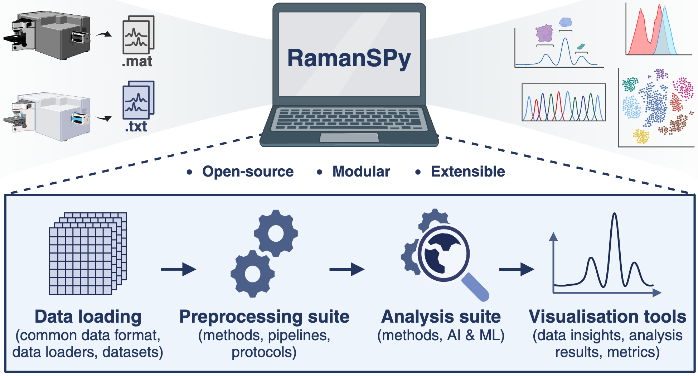

`RamanSPy`
=================================

`RamanSPy` is an open-source Python library for Raman spectroscopic research and analysis, which accelerates
day-to-day analyses, research applications, as well as the development and validation of new methods and algorithms.

|

|

Key features
-----------------
- Common data format
- Data loaders
- Preprocessing methods
- Preprocessing pipelining
- Preprocessing protocols
- Analysis methods
- AI and ML integration
- Visualisation tools
- Datasets
- Synthetic data generator
- Metrics

|

Getting started
----------------
To get started with `RamanSPy`, check :ref:`Overview` for a summary of `RamanSPy's` features and :ref:`Installation`
for installation instructions. Extensive documentation of `RamanSPy's` functionalities is available under `Documentation`.
:ref:`Tutorials` and :ref:`Examples` are also provided in our `Gallery` section.

|

Credits
-----------------
If you use this package for your research, please cite our paper:

`Georgiev, D.; Pedersen, S. V.; Xie, R.; Fernández-Galiana, Á.; Stevens, M. M.; Barahona, M. RamanSPy: An open-source Python package for integrative Raman spectroscopy data analysis. ACS Analytical Chemistry 2024, 96(21), 8492-8500, DOI: 10.1021/acs.analchem.4c00383 <https://pubs.acs.org/doi/10.1021/acs.analchem.4c00383>`_

|

Also, if you find *RamanSPy* useful, please consider leaving a star on GitHub:

.. raw:: html

   <a class="github-button" href="https://github.com/barahona-research-group/RamanSPy" data-icon="octicon-star" data-show-count="true" aria-label="Star RamanSPy on GitHub">Star</a>
   

|

.. toctree::
   :maxdepth: 1
   :caption: Quick start:
   :hidden:

   overview
   installation

.. toctree::
   :maxdepth: 1
   :caption: Documentation:
   :hidden:

   data_classes
   loading
   datasets
   metrics
   plot
   preprocessing
   analysis
   synth

.. toctree::
   :maxdepth: 1
   :caption: Gallery:
   :hidden:

   auto_tutorials/index
   auto_examples/index

.. toctree::
   :maxdepth: 1
   :caption: Links
   :hidden:

   GitHub repository <https://github.com/barahona-research-group/RamanSPy>
   Paper <https://pubs.acs.org/doi/10.1021/acs.analchem.4c00383>